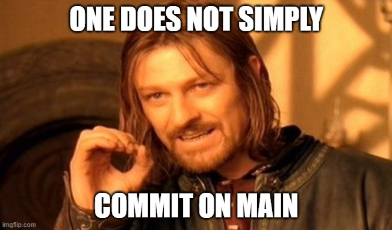
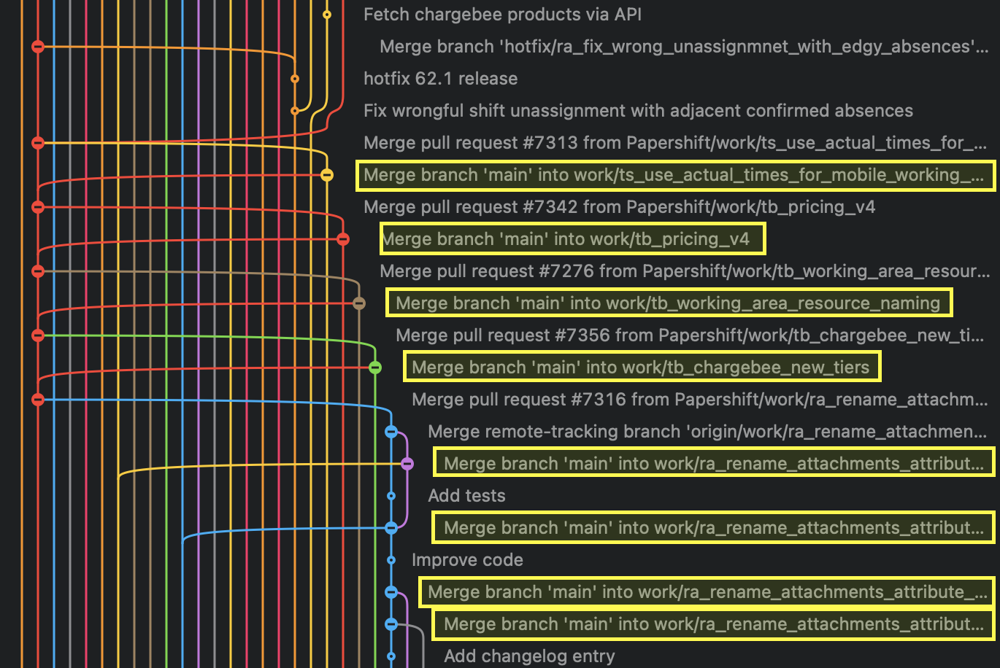

# git best practice 

## Workshop Part 1

### what is git 

- Versioning system
- philosophy how to work
    - asynchronous work
    - split work into small packages / tickets

- commits
- branches 
- tags

- local: clone of the repo on your machine (entire history, all branches, tags, ...)
- remote: repo on server, usually called origin.
   - There can be multiple remotes 

### branches 

- 1 main branch, usually main (deprecated: master)
- multiple short-lived feature branches: one per unit of work
- dirt-cheap

- always work on feature branches!



- once your changes are reviewed, feature branch is merged to main 

### tags

- long lived pointer to commit
- usually used for marking release versions


### commits

- commit = difference relative to parent(s)
- 1 commit = 1 logical unit
- changes that belong together
- each commit should compile

## work flow

### staging

- collect changes for commit

```
git add <fileName> [...]    # stage specified file
git add -i                  # stage only parts of a changed file
git add .                   # stage all git-known files
```

### committing

- "will this commit mess-up my future rebases?" 
    - formatting is a separate commit
    - renames, moving, add/delete src-files
    - Note: Windows does not differentiate between `Main.qml` and `main.qml`, git does!


- working on larger features: 
    - commit each subfeature separately -> squash later

- commit message:
    - descriptive: Bad: "Changed Param to 42", Good: "Solve the P=NP Problem"
    - prefix: fixup, add, refactor, `<subfeatureName>`, `<ticketNumber>`
    - Team-specific convention may apply
    - Format: https://stackoverflow.com/questions/2290016/git-commit-messages-50-72-formatting

```
Summary (50)

Full description (72 per line)
```

- commit regularly
    - make sure you can remember the changes done
        - leaving the topic -> commit your changes
        - avoid end of day (worst case: week) commit orgy
    - at the end of the day your branch should not contain any uncommitted and un-pushed changes

```
git commit -m msg
git push
```

#### Example

    - `featureBranch` erstellen
    - Neue Datei erstellen `main.cpp`
    - commit
    - push
    - main function commit -> suitable msg
    - push


### reverting

- revert already public (pushed) changes
- usage: when you have to avoid `push -f`

```
git revert <commit>
git push
```

#### Example
    - Letzten commit reverten
    - Revert reverten


### amending 

- Add changes to the latest **local** commit 
- And/Or change commit message of latest **local** commit

```bash
git add ...
git commit --amend 
git push
```

#### Example
    - Hello World -> Hallo Welt
    - amend to last commit


## Workshop Part 2

- Recap Part 1
    - commit msgs
    - amending
    - ...


### cherry-pick 

*Situation:*
- Some commit(s) might be useful in your current branch, but they are not merged yet
- A commit turns out to be worth a stand alone MR

*Best practice:*
- cherry-pick them 

*Commands:*

```bash
user@pc:~ (featureBranch)
    git cherry-pick <commit hash> 
```

### stash / pop 

*Situation:*
- Uncommitted changes but need to checkout a different branch in same repo in order to quickly test something

*Best practice:*
- stash your uncommitted work to be able to change the branch
- at most one stash and **not** for long


*Commands:*

```bash
user@pc:~ (featureBranch)
    git stash
    git checkout main
user@pc:~ (main)
    git pull
    # do the test
    git checkout featureBranch
user@pc:~ (featureBranch)
    git stash pop 
```

*Note:* 
- you can pop changes where ever you want, also on another branch
- stashing adds weird commits to your history


### handling parallel work

*Situation:*
- You are working on `featureBranch`
- Already a couple of commits down
- While working on a feature, you are forced to implement a super urgent other feature in same repo

*Best Practice:*
- make sure your working copy is clean
- create new branch from `main`
- after implementation, create MR

*Commands:*
```bash
user@pc:~ (featureBranch) 
    git status  # should be clean
    git checkout main
user@pc:~ (main) 
    git pull # make sure local main is up to date
    git checkout -b superUrgentFeatureBranch

# [get sh!t done]

user@pc:~ (superUrgentFeatureBranch)
    git add .
    git commit -m "add: superUrgentFeature"
    git push --set-upstream origin superUrgentFeatureBranch
```

### merging


*Situation:*

- You want to merge the super urgent feature

*Best Practice:*

- Only merge to `main` via MR remote server (i.e. gitlab). 
- You create an MR on git-server 
- You find a reviewer for your MR
- `superUrgentFeatureBranch` is merged after review

*Demo*

- [Gitlab repository graph](https://gitlab.marinom.de/marinom/stammtisch/git-best-practices/-/network/main?ref_type=heads)
- vscode gitGraph


### rebasing (w/o conflicts)

*Situation:*
- Upstream main was updated. 


*Best practice:*

- Rebase your working branch(es) on a daily base
- why?
    - potential conflicts are more easily solved if they come in small pieces
    - ancient branches are prone to bit rotting
    - a linear history is (more) comprehensible
    - nobody likes this: 




*Commands:*

```bash
user@pc:~ (superUrgentFeatureBranch)
    # update main, delete stale tracking branches
    git fetch origin --prune main:main
    git checkout featureBranch
user@pc:~ (featureBranch)
    git branch -d superUrgentFeatureBranch # delete local branch
    git rebase main
```


### rebasing (w conflicts)

*Situation:*
- Upstream main was updated
- You rebase your working branch
- Your working branch adds conflicting changes

*Best practice:*
- abort rebase
- backup your working branch (pushing `git push` or local copy `git checkout -b backup`)
- rebase again
- grab coffee and solve the conflicts
- delete backup (`push --force-with-lease` or `git branch -D backup`)

*Example:*

- Dennis does turkish
- Lars does english
- Dennis merged
- Lars rebased -> kaputt


*Commands:*

```bash
user@pc:~ (featureBranch)
    # update main, delete stale tracking branches
    git fetch origin --prune main:main
    git rebase main
    # [conflicting!]
    git rebase --abort
    # backup and git fetch coffee
    git rebase main
    git add # ...
    git commit # ...
    git rebase --continue
```

*Take away:*
- if there are many conflicts your commit history might be optimizable


### interactive rebase 

*Situation:*
- You want to create a MR with a clean commit history


*Best practice:*
- reorder your commits and
- squash commits that belong together 

*Commands:*

```bash
user@pc:~ (featureBranch)
    git rebase -i HEAD~<numCommits> # Head - num commits
    git rebase -i <commit hash> # till this commit - non-inclusive
    git rebase -i <branchName> # till this branch ptr - non-inclusive
    # tidy up history
    git push -f  #--force-with-lease  # use with care
```

*Take away:*
- if there are many conflicts, rethink your commit history 
- rewriting history helps you to clean up your mess - if there is any ;)


<!-- 
## tools

- tortoise
- vscode plugin: gitLens, gitGraph, Git supercharged


## Advanced git functions

- submodule
- reflog
- worktree
- lfs (immer wieder umstritten)


### reset 

- you are unhappy with a commit
- might want to split it in multiple commits 

```
git rebase -i HEAD~<numCommits>
# Mark the corresponding commit to stop here
git reset HEAD~
# commit as you now know it better
git rebase --continue
``` -->
